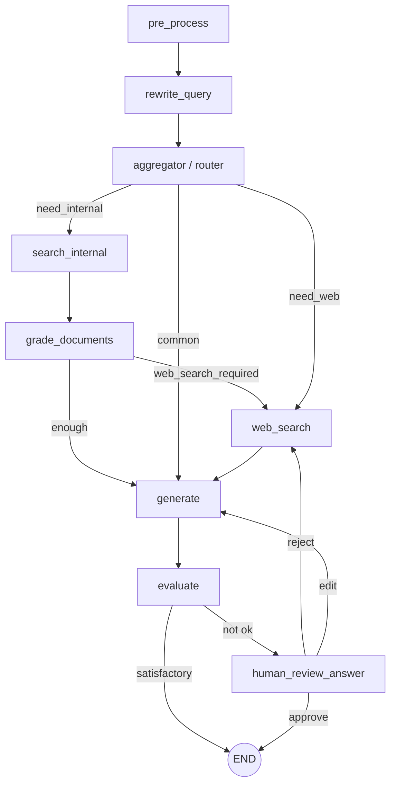

# 🤖 Chatbot Agentic RAG

**LangGraph + Chroma Cloud + Gemini**

Hệ thống Chatbot RAG dạng Agent cho phép:

* 🔎 Truy xuất tài liệu nội bộ từ Chroma Cloud
* 🌐 Tìm kiếm Web qua Google Custom Search (CSE)
* 🧠 Đánh giá chất lượng câu trả lời tự động
* 👤 Human-in-the-loop (HITL)
* 💬 Giao diện chat web tĩnh (HTML/CSS/JS)

---

# 🏗 Kiến Trúc Tổng Quan



---

# 🧩 Thành Phần Hệ Thống

## Backend

* `app.py`: Flask API
* `graph.py`: Build & compile LangGraph workflow
* `state.py`: Định nghĩa GraphState
* `nodes/`: Các node xử lý
* `chains/prompts.py`: Prompt templates

## Frontend

* `index.html`
* `script.js`
* `style.css`

Frontend gọi API:

```
POST /ask
```

---

# ⚙️ Công Nghệ Sử Dụng

* Python + Flask
* LangChain + LangGraph
* Google Gemini
* Chroma Cloud (Vector Database)
* SentenceTransformers (Embedding + Reranker)
* Google Custom Search API
* pyngrok (tuỳ chọn)

---

# 📁 Cấu Trúc Thư Mục

```
project-root/
│
├── app.py
├── graph.py
├── state.py
├── nodes/
├── chains/prompts.py
├── index.html
├── script.js
├── style.css
├── requirements.txt
└── .env
```

---

# 🧪 Yêu Cầu Hệ Thống

* Python 3.10+

## API Keys bắt buộc

* GOOGLE_API_KEY
* CHROMA_API_KEY
* CHROMA_TENANT
* CHROMA_DATABASE
* CHROMA_COLLECTION_NAME

## Web Search (tuỳ chọn)

* GOOGLE_CSE_API_KEY
* GOOGLE_CSE_CX_ID

---

# 🚀 Cài Đặt

```bash
python -m venv .venv
.venv\Scripts\activate
pip install -r requirements.txt
```

Nếu thiếu dotenv:

```bash
pip install python-dotenv
```

---

# 🔧 Cấu Hình .env

```dotenv
PORT=5000

# Gemini
GOOGLE_API_KEY=YOUR_GEMINI_KEY
GEN_FAST_MODEL=gemini-2.5-flash-lite
GEN_STRONG_MODEL=gemini-2.5-flash
GEN_TEMPERATURE=0.2

# Chroma Cloud
CHROMA_API_KEY=YOUR_CHROMA_KEY
CHROMA_TENANT=YOUR_TENANT
CHROMA_DATABASE=YOUR_DATABASE
CHROMA_COLLECTION_NAME=YOUR_COLLECTION

# Web Search
GOOGLE_CSE_API_KEY=YOUR_CSE_KEY
GOOGLE_CSE_CX_ID=YOUR_CX_ID
```

---

# ▶️ Chạy Dự Án

## Chạy Backend

```bash
python app.py
```

Mặc định: [http://localhost:5000](http://localhost:5000)

API chính:

* POST /ask
* GET /_public_url

## Chạy Frontend

Mở index.html trực tiếp hoặc dùng Live Server.

Trong `script.js`, sửa:

```javascript
const API = "http://localhost:5000/ask";
```

---

# 💬 Luồng Chat

Request mẫu:

```json
{
  "question": "...",
  "history": [],
  "thread_id": null
}
```

Response thành công:

```json
{
  "status": "OK",
  "answer": "...",
  "history": [...]
}
```

Response yêu cầu HITL:

```json
{
  "status": "INTERRUPTED",
  "interrupts": [...],
  "thread_id": "..."
}
```

---

# 👤 Human-in-the-Loop

Các lựa chọn:

* approve
* reject
* edit

Resume bằng curl:

```bash
curl -X POST http://localhost:5000/ask \
  -H "Content-Type: application/json" \
  -d "{\"thread_id\":\"THREAD_ID\",\"resume\":\"approve\"}"
```

---

# 📌 Ghi Chú

* Nếu Chroma lỗi → fallback sang web search (nếu cấu hình CSE).
* UI chạy tĩnh, không serve từ Flask.

---

# 📄 License

Dự án phục vụ mục đích học tập và nghiên cứu.
