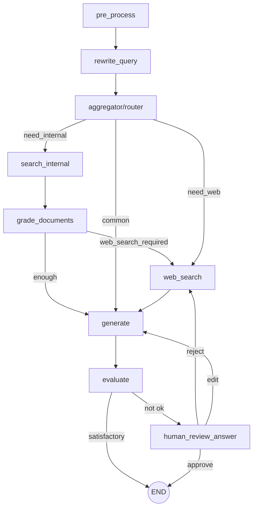

🤖 Chatbot Agentic RAG
LangGraph + Chroma Cloud + Gemini
Hệ thống Agentic RAG Chatbot cho phép:
🔎 Truy xuất tài liệu nội bộ từ Chroma Cloud

🌐 Tìm kiếm Web qua Google Custom Search (CSE) khi cần

🧠 Đánh giá chất lượng câu trả lời tự động

👤 Hỗ trợ Human-in-the-loop (HITL)

💬 Giao diện chat web tĩnh (HTML/CSS/JS)

🏗 Kiến Trúc Tổng Quan
Backend sử dụng LangGraph để orchestration theo dạng state machine.

📌 Luồng hoạt động

Tiền xử lý & rewrite câu hỏi
Router quyết định:
Truy xuất tài liệu nội bộ
Tìm kiếm web hoặc trả lời trực tiếp
Sinh câu trả lời
Tự đánh giá chất lượng
Nếu chưa đạt → kích hoạt HITL

🧩 Thành Phần Hệ Thống
🔹 Backend
Flask API 
LangGraph workflow 
Nodes xử lý
Prompt templates 
🔹 Frontend
index.html
script.js
style.css
Giao diện web tĩnh, gọi API POST /ask.

⚙️ Công Nghệ Sử Dụng
Python + Flask
LangChain + LangGraph
Google Gemini (via langchain-google-genai)
Chroma Cloud (Vector Database)
SentenceTransformers (BGE embedding + reranker)
Google Custom Search API
pyngrok (tuỳ chọn)
Yêu Cầu Hệ Thống

Python 3.10+
API Keys:

🔑 Bắt buộc
GOOGLE_API_KEY (Gemini)
CHROMA_API_KEY
CHROMA_TENANT
CHROMA_DATABASE
CHROMA_COLLECTION_NAME

🌐 Web Search (tuỳ chọn)

GOOGLE_CSE_API_KEY
GOOGLE_CSE_CX_ID
📄 License
Dự án phục vụ mục đích học tập và nghiên cứu.
